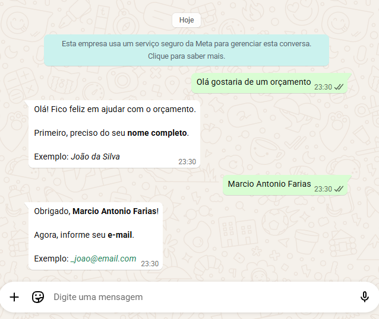

# WhatsApp Cloud API — .NET Integration

ASP.NET Core Web API integrada com a [WhatsApp Cloud API da Meta](https://developers.facebook.com/docs/whatsapp/cloud-api), com suporte a envio de mensagens e fluxo conversacional via webhook.



---

## Funcionalidades

- **Envio de mensagens** via `POST /whatsapp/send`
- **Webhook** para recebimento de mensagens em tempo real
- **Fluxo conversacional com coleta de dados** acionado pela frase "Ola gostaria de um orçamento"
- **Validação de campos** (nome completo, e-mail, data de nascimento)
- **Swagger UI** disponível em `/swagger`
- **Docker** pronto para deploy na porta 80

---

## Stack

| Tecnologia | Uso |
|---|---|
| .NET 9 / ASP.NET Core | Framework principal |
| Swashbuckle | Swagger UI |
| System.Text.Json | Serialização |
| HttpClient (typed) | Chamadas à API da Meta |
| ConcurrentDictionary | Estado de sessão em memória |

---

## Estrutura do projeto

```
TodoApi/
├── Controllers/
│   ├── WebhookController.cs       # GET + POST /webhook
│   ├── WhatsAppController.cs      # POST /whatsapp/send
│   └── BikeRentalController.cs    # POST /bikerental (exemplo base)
├── Services/
│   ├── WhatsAppService.cs         # Integração HTTP com a API da Meta
│   └── ConversationService.cs     # Máquina de estados do fluxo conversacional
├── Models/
│   └── WhatsAppWebhookPayload.cs  # Modelos do payload do webhook
├── Dockerfile
├── appsettings.json
└── Program.cs
```

---

## Configuração

O arquivo `appsettings.json` está no `.gitignore` e **nunca deve ser commitado**.

Copie o arquivo de exemplo e preencha com suas credenciais:

```bash
cp TodoApi/appsettings.example.json TodoApi/appsettings.json
```

Em seguida, preencha os campos no `appsettings.json`:

```json
{
  "WhatsApp": {
    "AccessToken": "SEU_ACCESS_TOKEN",
    "PhoneNumberId": "SEU_PHONE_NUMBER_ID",
    "VerifyToken": "token_secreto_que_voce_escolhe",
    "To": "5511999999999"
  }
}
```

| Campo | Onde encontrar |
|---|---|
| `AccessToken` | Meta for Developers → WhatsApp → API Setup → Temporary access token |
| `PhoneNumberId` | Meta for Developers → WhatsApp → API Setup → Phone Number ID |
| `VerifyToken` | Qualquer string — você define e registra no painel da Meta |
| `To` | Número de destino no formato `5511999999999` (sem `+`) |

### Em produção — variáveis de ambiente

O .NET lê variáveis de ambiente automaticamente, usando `__` como separador de hierarquia. Prefira esse método em vez de arquivos de configuração em servidores e containers:

```bash
WhatsApp__AccessToken=...
WhatsApp__PhoneNumberId=...
WhatsApp__VerifyToken=...
WhatsApp__To=...
```

---

## Rodando localmente

```bash
cd TodoApi
dotnet run
```

Acesse o Swagger em: `http://localhost:5098/swagger`

---

## Rodando com Docker

```bash
cd TodoApi

docker build -t whatsapp-api .
docker run -p 80:80 whatsapp-api
```

A API ficará disponível em `http://localhost/swagger`.

Para passar as credenciais sem alterar o `appsettings.json`:

```bash
docker run -p 80:80 \
  -e WhatsApp__AccessToken=SEU_TOKEN \
  -e WhatsApp__PhoneNumberId=SEU_ID \
  -e WhatsApp__VerifyToken=SEU_TOKEN_SECRETO \
  whatsapp-api
```

---

## Configurando o Webhook na Meta

1. Acesse [Meta for Developers](https://developers.facebook.com) → seu app → **WhatsApp → Configuration**
2. Em **Webhook**, clique em **Edit**
3. Preencha:
   - **Callback URL:** `https://SEU_DOMINIO/webhook`
   - **Verify Token:** o mesmo valor do `VerifyToken` no `appsettings.json`
4. Clique em **Verify and Save**
5. Em **Webhook fields**, habilite o campo **messages**

### Testando localmente com ngrok

```bash
# Terminal 1 — API
dotnet run

# Terminal 2 — túnel público
ngrok http 5098
```

Use a URL gerada pelo ngrok (ex: `https://abc123.ngrok-free.app`) como Callback URL na Meta, adicionando `/webhook` ao final.

---

## Fluxo conversacional

Acionado quando o usuário envia uma mensagem contendo "orçamento":

```
Usuário → "Ola gostaria de um orçamento"
    Bot → Solicita nome completo (com exemplo)

Usuário → "João da Silva"
    Bot → Solicita e-mail (com exemplo)

Usuário → "joao@email.com"
    Bot → Solicita data de nascimento (com exemplo)

Usuário → "15/03/1990"
    Bot → Confirma todos os dados coletados
```

**Validações aplicadas:**

| Campo | Regra |
|---|---|
| Nome | Mínimo 2 palavras, apenas letras |
| E-mail | Formato válido de endereço de e-mail |
| Data de nascimento | Formato `dd/MM/yyyy`, idade entre 1 e 120 anos |

Se a validação falhar, o bot informa o erro e repete a solicitação com um exemplo.

O estado de cada conversa é mantido em memória por número de telefone, permitindo múltiplos usuários simultâneos sem interferência.

---

## Endpoints

| Método | Rota | Descrição |
|---|---|---|
| `GET` | `/webhook` | Verificação do webhook pela Meta |
| `POST` | `/webhook` | Recebimento de mensagens |
| `POST` | `/whatsapp/send` | Envio de mensagem para o número configurado |
| `POST` | `/bikerental` | Endpoint de exemplo |

