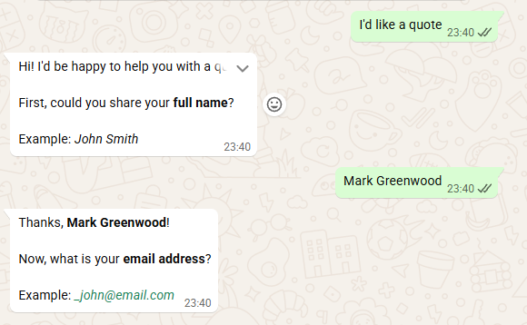

# WhatsApp Cloud API — .NET Integration

ASP.NET Core Web API integrated with the [Meta WhatsApp Cloud API](https://developers.facebook.com/docs/whatsapp/cloud-api), supporting message sending and a stateful conversational flow via webhook.



---

## Features

- **Send messages** via `POST /whatsapp/send`
- **Webhook** for receiving real-time messages
- **Conversational flow with data collection**, triggered by the phrase *"I'd like a quote"*
- **Field validation** (full name, email, date of birth)
- **Swagger UI** available at `/swagger`
- **Docker-ready** for deployment on port 80

---

## Tech Stack

| Technology | Purpose |
|---|---|
| .NET 9 / ASP.NET Core | Core framework |
| Swashbuckle | Swagger UI |
| System.Text.Json | JSON serialization |
| HttpClient (typed) | Meta API HTTP calls |
| ConcurrentDictionary | In-memory session state |

---

## Project Structure

```
TodoApi/
├── Controllers/
│   ├── WebhookController.cs       # GET + POST /webhook
│   ├── WhatsAppController.cs      # POST /whatsapp/send
│   └── BikeRentalController.cs    # Base example endpoint
├── Services/
│   ├── WhatsAppService.cs         # Meta API HTTP integration
│   └── ConversationService.cs     # Conversational state machine
├── Models/
│   └── WhatsAppWebhookPayload.cs  # Webhook payload models
├── Dockerfile
├── appsettings.example.json
└── Program.cs
```

---

## Configuration

`appsettings.json` is listed in `.gitignore` and **must never be committed**.

Copy the example file and fill in your credentials:

```bash
cp TodoApi/appsettings.example.json TodoApi/appsettings.json
```

Then edit `appsettings.json`:

```json
{
  "WhatsApp": {
    "AccessToken": "YOUR_ACCESS_TOKEN",
    "PhoneNumberId": "YOUR_PHONE_NUMBER_ID",
    "VerifyToken": "a_secret_string_you_choose",
    "To": "15551234567"
  }
}
```

| Field | Where to find it |
|---|---|
| `AccessToken` | Meta for Developers → WhatsApp → API Setup → Temporary access token |
| `PhoneNumberId` | Meta for Developers → WhatsApp → API Setup → Phone Number ID |
| `VerifyToken` | Any string you choose — register the same value in the Meta dashboard |
| `To` | Destination phone number without `+` (e.g. `15551234567`) |

### Production — environment variables

.NET reads environment variables automatically using `__` as the hierarchy separator. Prefer this approach over config files on servers and containers:

```bash
WhatsApp__AccessToken=...
WhatsApp__PhoneNumberId=...
WhatsApp__VerifyToken=...
WhatsApp__To=...
```

---

## Running Locally

```bash
cd TodoApi
dotnet run
```

Swagger UI: `http://localhost:5098/swagger`

---

## Running with Docker

```bash
cd TodoApi

docker build -t whatsapp-api .
docker run -p 80:80 whatsapp-api
```

API available at `http://localhost/swagger`.

To pass credentials at runtime without editing config files:

```bash
docker run -p 80:80 \
  -e WhatsApp__AccessToken=YOUR_TOKEN \
  -e WhatsApp__PhoneNumberId=YOUR_ID \
  -e WhatsApp__VerifyToken=YOUR_SECRET \
  whatsapp-api
```

---

## Configuring the Webhook on Meta

1. Go to [Meta for Developers](https://developers.facebook.com) → your app → **WhatsApp → Configuration**
2. Under **Webhook**, click **Edit**
3. Fill in:
   - **Callback URL:** `https://YOUR_DOMAIN/webhook`
   - **Verify Token:** the same value set in `VerifyToken`
4. Click **Verify and Save**
5. Under **Webhook fields**, enable **messages**

### Testing locally with ngrok

```bash
# Terminal 1 — run the API
dotnet run

# Terminal 2 — expose a public tunnel
ngrok http 5098
```

Use the ngrok-generated URL (e.g. `https://abc123.ngrok-free.app/webhook`) as the Callback URL on Meta.

---

## Conversational Flow

Triggered when the user sends a message containing the word **"quote"**.

```
User  → "I'd like a quote"
  Bot → Asks for full name        (with example)

User  → "John Smith"
  Bot → Asks for email address    (with example)

User  → "john@email.com"
  Bot → Asks for date of birth    (with example)

User  → "03/15/1990"
  Bot → Confirms all collected data
```

**Validation rules:**

| Field | Rule |
|---|---|
| Full name | At least 2 words, letters only |
| Email | Valid email address format |
| Date of birth | Format `MM/dd/yyyy`, age between 1 and 120 |

If validation fails, the bot sends an error message and repeats the prompt with an example.

Session state is stored in-memory per phone number, allowing multiple simultaneous users without interference.

---

## Endpoints

| Method | Route | Description |
|---|---|---|
| `GET` | `/webhook` | Meta webhook verification |
| `POST` | `/webhook` | Receive incoming messages |
| `POST` | `/whatsapp/send` | Send a message to the configured number |
| `POST` | `/bikerental` | Base example endpoint |
